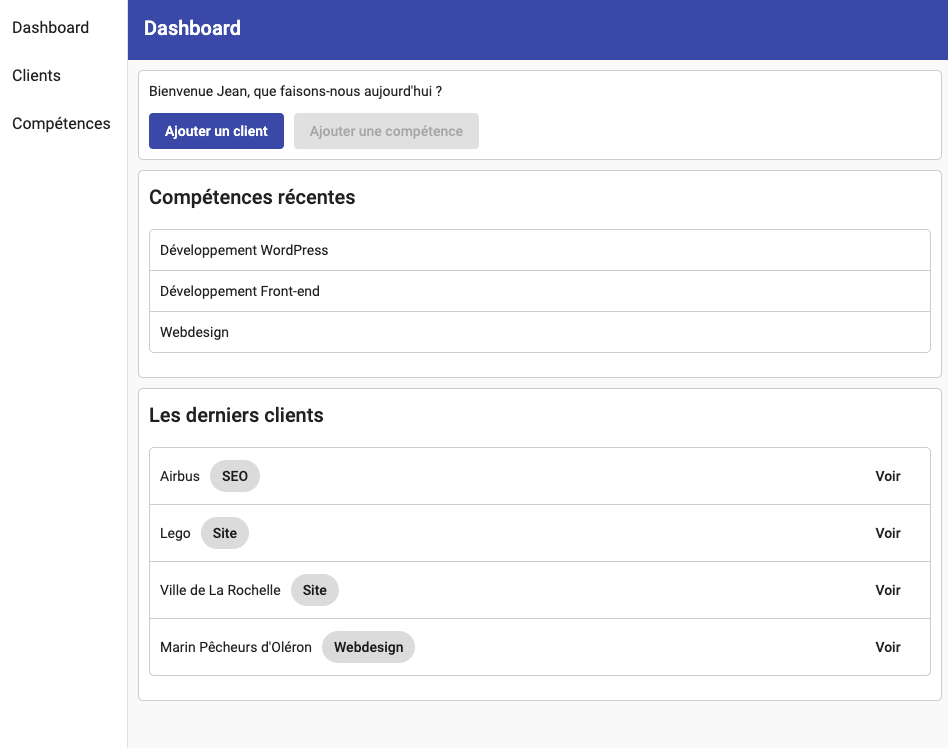

# Formation Angular Administration
Premier pas et initiation au framework Angular avec le développement d'une webapp d'administration.

## Table des matières :

- [Premier pas avec Angular](/1_Premier%20pas%20avec%20Angular.md)
- [Créer le dashboard](/2_Creer%20le%20Dashboard.md)
- [Créer le menu principal](/3_Creer%20le%20menu%20principal.md)
- [Créer des composants partagés](/4_Creer%20des%20composants%20partages.md)
- [Gérer la donnée](/5_Gérer%20la%20donnée.md)
- [Ajouter du contenu](/6_Ajouter%20du%20contenu.md)
- [Envoyer ses données](/7_Envoyer%20ses%20données.md)
- [Sécuriser notre application](/8_Sécuriser%20notre%20application.md)
- [Modifier du contenu](/9_Modifier%20du%20contenu.md)
## Concept

Abordez Angular avec cette suite de travaux pratiques qui vous permettrons de voir pas à pas les différentes notions importantes du framework.
Au programme : Angular CLI, Composant, Formulaire, Routing, Http, etc...

Nous nous aiderons d'[Angular Material](https://material.angular.io) pour le style global de notre administration.

